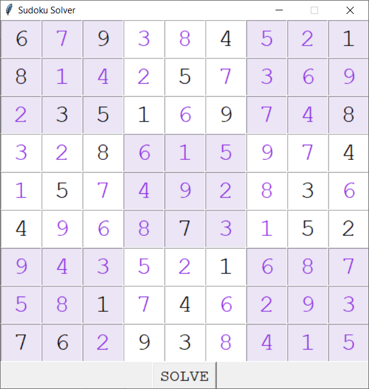

# Sudoku Solver

### About
Sudoku Solver is a Python application created with Tkinter that allows the user to enter a sudoku puzzle and have it solved almost instantly with the result being displayed in a grid interface.
It first attempts to solve the puzzle by putting it through a set of rules such as ‘only one of each number in a 3x3 box’. If this isn’t enough to solve the puzzle, it then using a backtracking algorithm where it puts various numbers into the grid, swapping them for alternatives if any issues are encountered.
  
**Please note: If the solve button is clicked and no solution is generated, the puzzle is currently unable to be solved. In the future, I hope to improve upon my code so that a greater range of more difficult puzzles can be solved effectively.**

### Motivation
After looking around for similar projects, I realised that a vast majority of existing sudoku solvers require the user to enter the puzzle in the form of a 2D array which I thought may be confusing for those who don’t program themselves. Therefore, I decided to use Tkinter to create a sudoku solver that allows the user to enter their puzzle into a sudoku grid and have their solution displayed in the same way.

### Screenshots
**Sudoku before being solved:**

**Sudoku after being solved:**

### Packages
**Built with:**
- [Tkinter](https://docs.python.org/3/library/tkinter.html)

### Installation
In order for the python program to run the following packages/modules must be installed on the system:
- [Tkinter](https://docs.python.org/3/library/tkinter.html)
- [collections](https://docs.python.org/2/library/collections.html)

### Status
The sudoku solver is functional however in the future I would like to increase the size of the bank of rules that it uses and the efficiency of the backtracking algorithm so it can solve a greater range of puzzles. 

